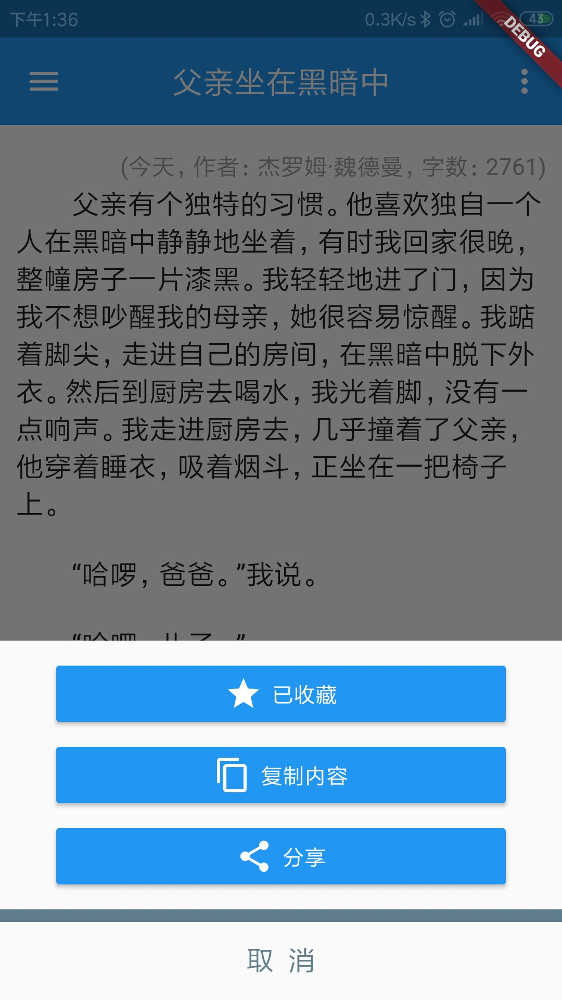
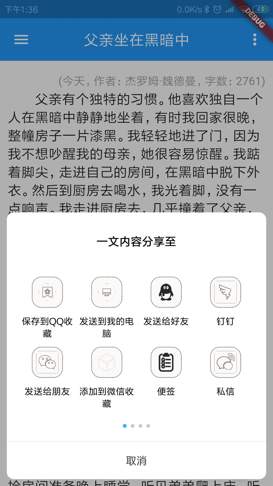
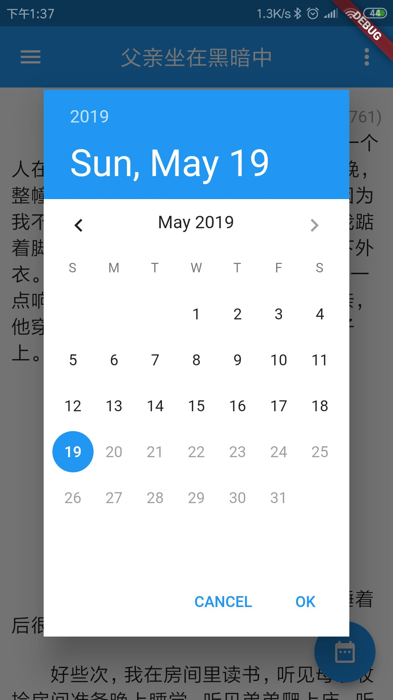
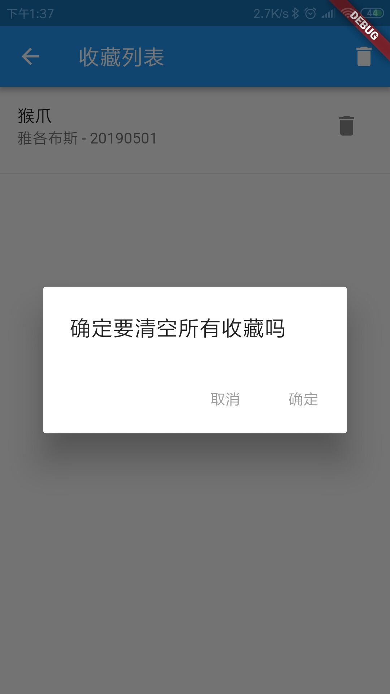
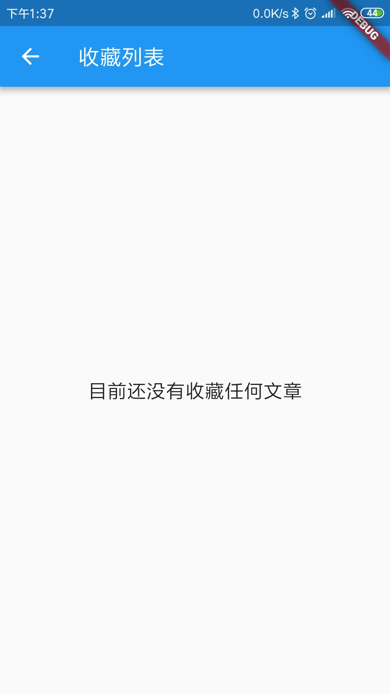

# study_flutter

一个菜鸟的第一个```Flutter``` APP，本文大部分设计摘抄自[一周时间编写你的第二个 Flutter APP](https://juejin.im/post/5cbbef1151882532826e7f0c).由于对于```Dart```和```Flutter```缺乏基本的熟悉，基本上算是以实战来作为学习方法，因此部分代码可能不是很规范，大家有发现的部分欢迎提出来一起交流。
该项目实际写作时间可能低于作者的时间，因为我大部分时间都是学习作者的源码，然后自己手动敲一遍，遇到不能理解的代码就百度，因此只有少部分的代码是自主开发的。效果如下：










## 待完成

 * 完成主体颜色修改
 * 语言国际化
 * 利用玩安卓的api实现TODO清单功能
 
 ---
 
#### 参考：[一周时间编写你的第二个 Flutter APP](https://juejin.im/post/5cbbef1151882532826e7f0c)
#### 参考：[Flutter 分享到第三方应用](https://github.com/zhouteng0217/ShareExtend)
#### 参考：[Flutter 原生平台交互](https://blog.csdn.net/duo_shine/article/details/81280954)

#### [源码：https://github.com/Vicent9920/study_flutter](https://github.com/Vicent9920/study_flutter)
